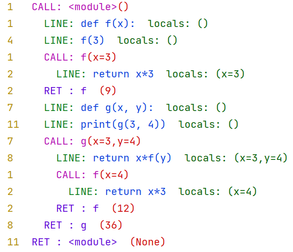

# hdbg - Historical Debugger

# This is in no way a finished product. Do not use this for anything.

`hdbg` extends the python debugger to print any line/call/return
to the screen so that the flow of the program can be inspected
after the fact.

## Example:

```python
# examplecode.py

def f(x):
    return x*3

f(3)


def g(x, y):
    return x*f(y)
print(g(3, 4))

```

```
>>> hdbg.run("import examplecode")
```


